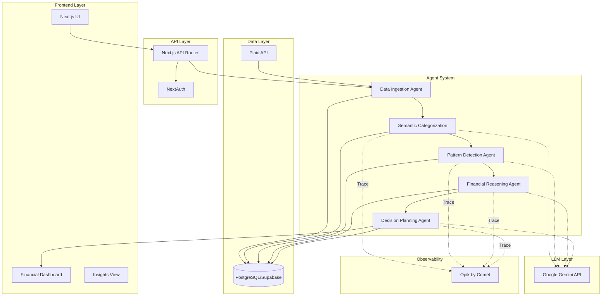
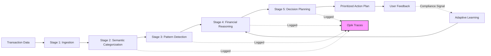
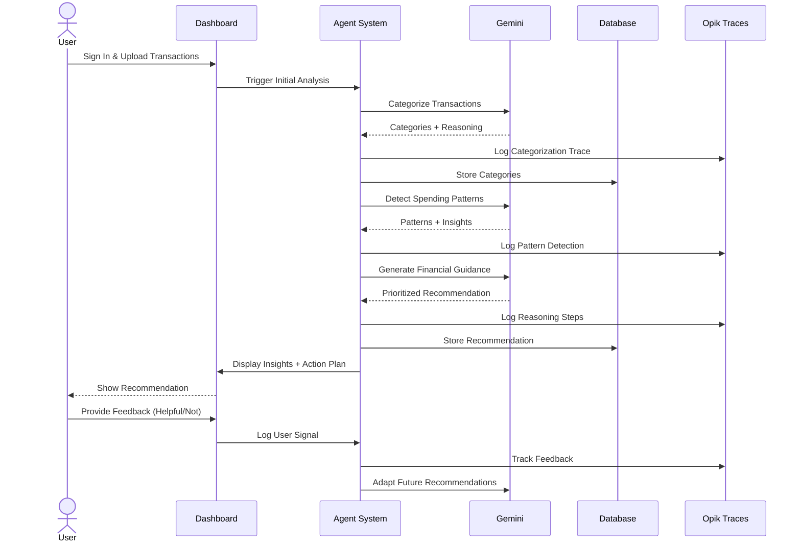

# 🧠 ClarityLab

**An Autonomous Financial Intelligence System**

ClarityLab is a research-driven, agentic personal finance platform that transforms financial decision-making from a passive tracking problem into an active reasoning problem. Instead of presenting raw data through dashboards, ClarityLab operates as a continuous financial reasoning engine that autonomously analyzes spending behavior, detects patterns, and generates explainable, prioritized financial guidance.

---

## 🎯 Problem Statement

Most personal finance tools are passive systems that leave users to interpret complex financial data on their own. Users don't fail because of lack of data—they fail because they lack:
- **Contextual reasoning** about their spending
- **Prioritization** of financial actions
- **Adaptive guidance** that evolves with their behavior

ClarityLab addresses this by reframing personal finance as a **reasoning problem**, not just a tracking problem.

---

## 🏗️ System Architecture



---

## 🔄 Multi-Stage Agent Pipeline



### Agent Stages Explained

1. **Data Ingestion**: Collects transaction data from Plaid or manual uploads
2. **Semantic Categorization**: LLM-powered transaction categorization (groceries, entertainment, etc.)
3. **Pattern Detection**: Identifies behavioral patterns and spending trends
4. **Financial Reasoning**: Evaluates budget adherence, analyzes trade-offs, generates insights
5. **Decision Planning**: Creates a single prioritized action plan with clear reasoning

---

## 👤 User Flow



---

## 🛠️ Tech Stack

| Layer | Technology |
|-------|-----------|
| **Frontend** | Next.js 16, React 19, TypeScript, Tailwind CSS |
| **Backend** | Next.js API Routes, Server Actions |
| **LLM** | Google Gemini API |
| **Agent Framework** | LangChain / LangGraph (or custom pipeline) |
| **Database** | PostgreSQL (Supabase) |
| **ORM** | Prisma |
| **Authentication** | NextAuth.js |
| **Observability** | Opik by Comet |
| **Bank Integration** | Plaid API (optional) |
| **Validation** | Zod |
| **UI Components** | Shadcn/ui |
| **Charts** | Recharts |

---

## 🚀 Key Features

### ✅ Autonomous Reasoning
- Operates continuously in the background
- No manual categorization or rule-setting required
- Self-improving through feedback loops

### ✅ Explainable Decisions
- Every recommendation includes full reasoning trace
- Users can inspect "why" behind each suggestion
- Transparent agent decision-making via Opik

### ✅ Single Priority Focus
- One clear action plan at a time (reduces decision fatigue)
- Prioritized by impact and feasibility
- Adaptive based on user compliance

### ✅ Behavioral Pattern Detection
- Identifies causal spending patterns
- Detects trends and anomalies automatically
- Provides forward-looking insights

### ✅ Full Observability
- All agent stages logged to Opik
- Measurable evaluation of decision quality
- Feedback loop for continuous improvement

---

## 📊 Key Metrics & Evaluation

ClarityLab measures success through:

- **Budget Adherence Rate**: % of time users stay within recommended budgets
- **Recommendation Follow-Through**: % of agent suggestions acted upon
- **Emergency Fund Progress**: Time to reach 3-6 month safety net
- **Agent Decision Quality**: Accuracy and relevance of financial guidance (via Opik)
- **User Validation Signals**: Helpful/Not helpful feedback trends

---

## 🏁 Getting Started

### Prerequisites

- Node.js 20+ 
- PostgreSQL (via Supabase)
- Google Gemini API Key
- Opik API Key

### Installation

```bash
# Clone the repository
git clone https://github.com/yourusername/claritylab.git
cd claritylab

# Install dependencies
npm install

# Set up environment variables
cp .env.example .env.local
# Add your API keys and database URL

# Run database migrations
npx prisma migrate dev

# Start development server
npm run dev
```

Open [http://localhost:3000](http://localhost:3000) to view the application.

---

## 📁 Project Structure

```
claritylab/
├── app/                    # Next.js App Router
│   ├── api/               # API routes
│   ├── dashboard/         # Dashboard pages
│   ├── insights/          # Insights view
│   └── auth/              # Authentication pages
├── lib/
│   ├── agents/            # Agent pipeline logic
│   ├── gemini/            # Gemini API integration
│   ├── opik/              # Opik tracing setup
│   └── prisma/            # Prisma client
├── components/            # React components
├── prisma/
│   └── schema.prisma      # Database schema
└── public/                # Static assets
```

---

## 🔐 Environment Variables

```env
# Database
DATABASE_URL="postgresql://..."

# Authentication
NEXTAUTH_SECRET="..."
NEXTAUTH_URL="http://localhost:3000"

# Gemini API
GEMINI_API_KEY="..."

# Opik
OPIK_API_KEY="..."
OPIK_PROJECT_NAME="claritylab"

# Plaid (optional)
PLAID_CLIENT_ID="..."
PLAID_SECRET="..."
```

---

## 🤝 Contributing

This is a research project focused on demonstrating autonomous financial reasoning agents. Contributions are welcome!

---

## 📄 License

MIT License - feel free to use this project for research and learning.

---

## 🌟 Project Goals

ClarityLab demonstrates:
- How autonomous AI agents can guide real-world financial decisions
- The importance of explainability in financial AI systems
- Measurable evaluation of agent effectiveness through Opik
- Responsible AI usage for budgeting and financial stability (not speculation)

**Built for the Financial Health theme** - Empowering users to make better financial decisions through autonomous, transparent, and accountable AI reasoning.
